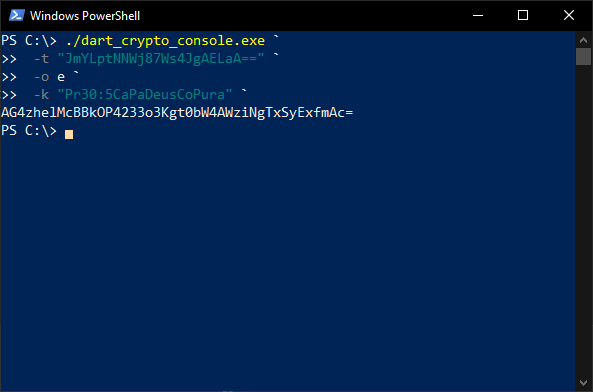

# DartCryptoConsole

<p align="center">
  
</p>

<div align="center">

[](https://dart.dev/) [](https://www.linux.org/) [](https://www.microsoft.com/pt-br/windows) [](http://makeapullrequest.com) [](LICENSE)

</div>

## About

DartCrytoConsole is console application that allows you to encrypt and decrypt texts in a simple way.



For downloads and more information visit the [Wiki](https://github.com/tglima/DartCrytoConsole/wiki).


## Requirements to build desktop version
* [Dart SDK](https://dart.dev/get-dart) 2.17.x
* [stagehand](https://pub.dev/documentation/stagehand/latest/stagehand/stagehand-library.html)

### Active stagehand

```dart
pub global activate stagehand
```

Export path
```sh
export PATH="$PATH":"$HOME/.pub-cache/bin"
```

## Compile

```dart
dart pub get
dart compile exe bin/main.dart -o bin/dart_crypto_console
```

## Examples

An example encrypt text using file compiled

```
dart_crypto_console -t "Efraim" -o e
```

### More examples
* [For Linux](docs/examples/linux_console.txt)
* [For Windows](docs/examples/win_console.txt)


## License
The source code of this application is under [MIT License](LICENSE), everything else must be considered registered content of their respective owners and developers.
